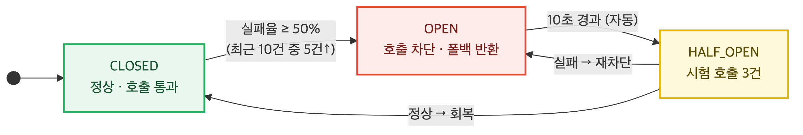

# service-communication-patterns-with-rest-api

> **REST 동기 통신 기반 MSA** — user·order 서비스를 독립 배포 단위로 분리하고, 서비스 간 동기 호출이 만드는 장애 전파(cascading failure)를 **Resilience4j
Circuit Breaker**로 격리해 부분 장애에도 시스템이 계속 응답하도록 설계한 학습용 프로젝트.

---

## 이 프로젝트가 다루는 것

MSA에서 서비스를 나누는 순간 **"한 서비스의 장애가 다른 서비스로 어떻게 전파되는가"** 가 핵심 문제가 된다.
이 저장소는 그 문제를 가장 단순한 형태 — REST 동기 호출 — 로 재현하고, **Circuit Breaker 패턴으로 전환**하는 과정을 담는다.

- 도메인을 **user-service / order-service** 두 개의 독립 배포 단위로 분리
- 한 서비스가 다른 서비스를 **동기 REST(RestTemplate)** 로 호출할 때 생기는 결합을 관찰
- 그 결합을 **서킷 브레이커 + 타임아웃 + 폴백(degrade)** 으로 끊어내는 구조로 리팩터링

## 시스템 구성

| 서비스               | 포트   | 책임                                                              | 저장소            |
|-------------------|------|-----------------------------------------------------------------|----------------|
| **user-service**  | 8081 | 사용자 도메인, `/users/me` 응답을 위해 order-service를 **호출하는 쪽(Consumer)** | H2 (in-memory) |
| **order-service** | 8082 | 주문 도메인, 주문 생성·조회를 제공하는 **호출받는 쪽(Provider)**                     | H2 (in-memory) |

두 서비스는 DB를 공유하지 않고(Database per Service), user-service가 order-service의 REST API를 **동기 호출**해 사용자 프로필과 주문 목록을 조합한다.

```
Client ──▶ user-service :8081 ──(RestTemplate 동기 호출)──▶ order-service :8082
                    │  GET /orders/{userId}
                    └──▶ 사용자 프로필 + 주문 목록 조합 응답
```

---

## 문제 인식 — 동기 REST 호출의 결합

`GET /users/me`는 사용자 프로필을 만들기 위해 order-service를 동기 호출한다.
이때 order-service가 **느려지거나 죽으면** 다음이 연쇄적으로 발생한다.

1. user-service의 요청 스레드가 응답을 기다리며 **블로킹** 된다.
2. 호출이 쌓이면 user-service의 **스레드 풀이 고갈**된다.
3. 결국 order와 **무관한 사용자 조회 기능까지 함께 죽는다** — 장애가 서비스 경계를 넘어 전파(cascading failure)된다.

즉, 서비스는 분리했지만 **런타임 결합(temporal coupling)** 은 그대로 남아 있어, order-service의 가용성이 user-service의 가용성을 그대로 끌어내린다.

## 해결 — Circuit Breaker 패턴으로 전환

order-service 호출을 **Resilience4j 서킷 브레이커로 감싼다.** 실패가 임계치를 넘으면 회로를 열어(OPEN) 호출 자체를 즉시 차단하고, 미리 정의한 **폴백 값으로 degrade** 한다.
덕분에 order-service가 죽어도 user-service는 **주문만 비운 채 프로필 응답을 계속 200으로 내려준다.**

<p align="center">
  
</p>

**상태 전이 규칙**

- **CLOSED** — 정상 상태. 호출을 그대로 통과시키되 최근 호출의 실패율을 집계한다.
- **OPEN** — 최근 10건 중 최소 5건이 집계된 상태에서 **실패율이 50%를 넘으면** 전이. 이후 모든 호출을 즉시 차단하고 `OrdersResult.UNAVAILABLE` 을 반환한다. (user
  프로필 응답은 200 유지)
- **HALF_OPEN** — OPEN 진입 후 10초가 지나면 자동 전이. 시험 호출 3건을 흘려보내 정상이면 CLOSED로 회복, 실패하면 다시 OPEN.

**핵심 설계 결정**

| 항목                                           | 값 / 정책                                    | 이유                                                                     |
|----------------------------------------------|-------------------------------------------|------------------------------------------------------------------------|
| `slidingWindowSize` ≥ `minimumNumberOfCalls` | 10 ≥ 5                                    | 최소 호출 수가 윈도우보다 크면 실패율이 영원히 계산되지 않아 **회로가 절대 열리지 않는다.** 이 불변식을 반드시 지킨다. |
| `recordExceptions`                           | `RestClientException`, `TimeoutException` | **다운스트림 장애만** 실패로 집계                                                   |
| `ignoreExceptions`                           | `4xx (HttpClientErrorException)`          | 4xx는 **호출자 잘못**이므로 회로를 여는 데 카운트하지 않는다                                  |
| `TimeLimiter`                                | 4초                                        | 서킷 브레이커만으로는 못 막는 **느린 응답**을 타임아웃으로 차단                                  |
| 폴백(degrade)                                  | `OrdersResult(status = UNAVAILABLE)`      | 장애를 **예외가 아닌 값**으로 표현해, 호출부가 부분 응답을 정상 흐름으로 처리                         |

상태 전이(CLOSED/OPEN/HALF_OPEN)는 `CircuitBreakerRegistry` 이벤트 리스너로 로깅해 장애·회복 과정을 관측할 수 있다.

---

## API 명세

### user-service (8081)

| Method | Path        | 설명                                                  |
|--------|-------------|-----------------------------------------------------|
| `POST` | `/users`    | 회원 가입                                               |
| `POST` | `/login`    | 로그인 → 토큰 발급                                         |
| `GET`  | `/users`    | 전체 사용자 조회                                           |
| `GET`  | `/users/me` | 내 프로필 + 내 주문 조회 (**order-service를 서킷 브레이커 경유로 호출**) |

### order-service (8082) — user-service가 내부적으로 호출

| Method | Path               | 설명                                |
|--------|--------------------|-----------------------------------|
| `POST` | `/orders/{userId}` | 주문 생성 (총액 불변식은 `Order` 애그리거트가 강제) |
| `GET`  | `/orders/{userId}` | 사용자별 주문 목록                        |

## 기술 스택

- **Kotlin 2.3**, **Spring Boot 4.1**, **Spring Cloud 2025.1** (Java 17)
- **Resilience4j** (`spring-cloud-starter-circuitbreaker-resilience4j`) — 서킷 브레이커 · 타임리미터
- **Spring Web / RestTemplate** — 서비스 간 동기 통신
- **Spring Data JPA + H2** (Database per Service)
- **Spring Security + JWT** (무상태 인증), **Spring Boot Actuator + Prometheus** (관측성)

## 실행 방법

```bash
# order-service (Provider) 먼저 기동
./gradlew :order:bootRun

# user-service (Consumer)
./gradlew :user:bootRun
```

- 기본 연결: user-service → `http://127.0.0.1:8082` (환경변수 `ORDER_SERVICE_URL` 로 오버라이드 가능 — 외부화된 설정)
- **서킷 브레이커 확인**: order-service를 내린 뒤 `GET /users/me` 를 반복 호출하면, 실패가 누적되며 회로가 OPEN으로 전이되고 응답의 `ordersStatus` 가
  `UNAVAILABLE` 로 바뀌는 것을 확인할 수 있다. 이때도 프로필 응답은 200으로 유지된다.
